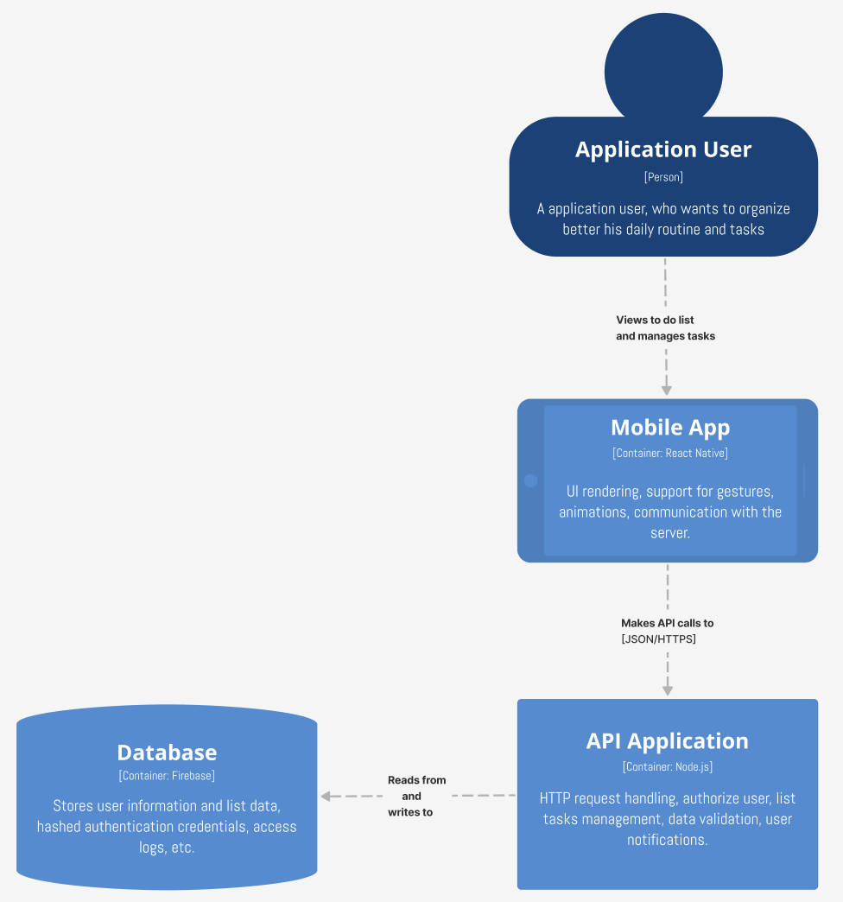

# Software-architecture-Todo-app

## 1. Description:

Todo app is simple and usefull tool, users can manage tasks and responsibilities effectively. App gives opportunity to create, track and prioritize tasks, ensuring that nothing important gets overlooked. The goal of the project is to help users stay organized, increase productivity.

### 1a. Main futures:

- Task creation: Users can easily create new tasks by entering a title and description set due date and reminder.
- Task edition: User can edit existing tasks, change title, description, date etc.
- Task deletion: User can delete taska
- Prioritization: Users can assign priority tasks, indicating their relative importance or urgency. This helps in focusing on high-priority tasks and ensuring that essential work gets completed on time.
- Reminders and Notifications: To ensure the tasks are not forgotten, user should have opportunity to set reminders and notifications. These can be set up to alert users at specific times.
- Progress Tracking: Progress tracking of user tasks. This can be done by marking tasks as complete, setting subtasks, or adding comments or notes to provide updates on the task's status.
- Customization: User can personalize the app appearance, choose different themes, or adjust settings to suit his workflow.

## 2. Context

The Todo List App is the software system being represented. It contains the necessary functionality to create, track, and manage tasks. The User interacts with the Todo List App through a user interface, which is a mobile app. Written using Typescript language and React Native framework.

## 3. Container

App will have three containers:

- Mobile application
- Rest API
- Database

#### User

The user represents the person who interacts with the To Do List app through the mobile app. The user interacts with the application by sending requests, based on which it receives responses consistent with the state of the database.

### 3a. Mobile application

App has a minimalist, intuitive and simple interface. Focused on simplicity and clarity, such an interface may only contain basic elements such as a task list, buttons for adding. We can use simple but nice animations, additionally add gestures to enhance the user experience.

### 3b. Rest API

API methods for main features:

GET:

- Retrieves a representation of the to-do list
- Filters and proritizes list
- Returns task's details

POST:

- Creates a new tasks based on the provided data

PUT:

- Updates an existing tasks

DELETE:

- Deletes the tasks

URIs: Resources are identified using URIs. For example, a URI for a task resource in a Todo List API could be
`BASEURL/tasks/{taskId}.`

Data Format: We will use JSON (JavaScript Object Notation) JSON is used because of its simplicity and ease of parsing and reusing on frontend side.

Authentication and Authorization: We will authorize the user and store his sessions based on the JWT Token.

Notifications: We'll use Firebase and his SDK for push notifications.

### 3a. Database

The database container represents the storage system for the application. It stores data related to tasks, users and other relevant information. The best choice for this simple application is the cloud-hosted and non-relational Firebase database. In addition, Firebase provides a lot of SDKs that can help in development.

